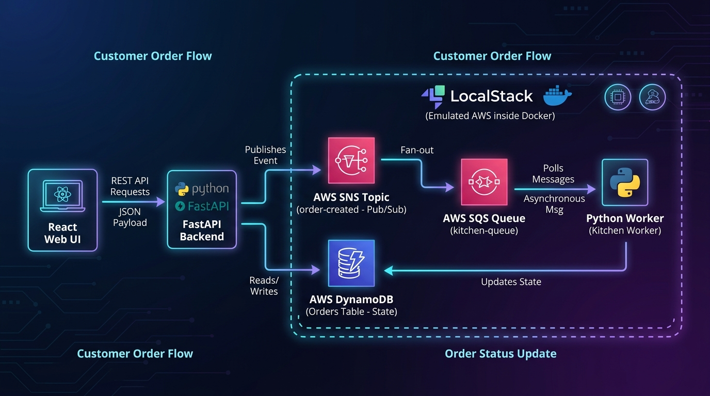

# Event-Driven Architecture: Simulador de Pedidos com AWS SNS, SQS e DynamoDB

Este projeto foi desenvolvido com foco no estudo prático e aprofundado de **Arquitetura Orientada a Eventos (Event-Driven Architecture - EDA)** e processamento assíncrono de dados em nuvem. Como estudo de caso e referência de domínio, foi utilizado o fluxo de checkout e ciclo de vida de pedidos em grande escala característico de plataformas como o **iFood**.

Para viabilizar o desenvolvimento ágil, testes integrados de resiliência e eliminação de custos de nuvem sem comprometer a fidelidade do código, a infraestrutura da **AWS** foi totalmente emulada localmente através do **LocalStack** orquestrado via **Docker Compose**. O código-fonte consome o SDK oficial da Amazon (`boto3`), mantendo paridade absoluta com um ambiente de produção real.

---

## Arquitetura do Sistema



### Visão Geral do Fluxo de Dados

A solução adota o princípio de **desacoplamento temporal e de serviços**: a camada de ingestão (API HTTP) não processa diretamente as regras de negócio de longa duração, evitando contenção de conexões e garantindo alta disponibilidade (p99 baixo).

1. **Ingestão (Frontend React):** O cliente final seleciona os itens e submete o pedido via requisição REST assíncrona.
2. **API Gateway & Persistência Inicial (Python / FastAPI):**
   - Recebe o payload, valida a integridade dos dados e gera um identificador único (`order_id`).
   - Grava o estado inicial do pedido como `PENDING` no **AWS DynamoDB**.
   - Publica um evento de domínio no **AWS SNS** e devolve resposta `201 Created` imediata ao cliente.
3. **Distribuição Fan-Out (AWS SNS):**
   - O tópico `order-created` recebe a mensagem e a replica instantaneamente para os consumidores inscritos.
4. **Enfileiramento Persistente (AWS SQS):**
   - A fila `kitchen-queue` armazena a mensagem de forma durável, atuando como buffer contra picos de tráfego.
5. **Processamento Assíncrono (Python Background Worker):**
   - O worker consome a fila via **Long Polling**, atualiza a máquina de estados no DynamoDB para `PREPARING`, executa a regra de preparo e conclui atualizando para `READY`.
   - Apenas após a persistência bem-sucedida, o worker emite o delete da mensagem no SQS, garantindo resiliência (*At-Least-Once Delivery*).
6. **Telemetria e Acompanhamento em Tempo Real:**
   - O frontend monitora o estado no DynamoDB através de polling de baixa sobrecarga e expõe logs de eventos da AWS em um painel de telemetria.

---


---
## Papel dos Serviços da AWS no Projeto

A arquitetura foi desenhada aproveitando os pontos fortes de cada serviço do ecossistema AWS:

| Serviço AWS | Componente | Papel Arquitetural e Justificativa Técnica |
| :--- | :--- | :--- |
| **AWS SNS** *(Simple Notification Service)* | Tópico `order-created` | **Mensageria Pub/Sub (1-para-N).** Desacopla a API de pedidos dos serviços consumidores. Novos microsserviços (como faturamento, antifraude ou notificações push) podem se conectar ao tópico sem demandar alterações na API de ingestão. |
| **AWS SQS** *(Simple Queue Service)* | Fila `kitchen-queue` | **Buffer assíncrono e controle de concorrência.** Garante persistência e tolerância a falhas. Protege os serviços internos caso a taxa de pedidos supere a capacidade de processamento imediato dos workers. Suporta políticas de visibilidade e retry. |
| **AWS DynamoDB** | Tabela `Orders` | **Banco de dados NoSQL Chave-Valor.** Proporciona latência de leitura e escrita previsível em milissegundos de um dígito, mesmo sob alta concorrência. Utilizado para armazenar o estado ativo da transação indexado pela chave primária `order_id`. Tipos numéricos foram modelados com precisão `Decimal` para evitar erros de ponto flutuante. |
| **Boto3 (SDK AWS)** | Camada de Integração Python | SDK oficial utilizado pela API e pelos Workers para comunicação direta com a API da AWS, configurado dinamicamente para apontar para o LocalStack em desenvolvimento ou endpoints gerenciados da nuvem em produção. |

---

## Tecnologias e Stack Utilizada

- **Linguagem Backend:** Python 3.11
- **Framework API:** FastAPI / Uvicorn (I/O assíncrono de alta performance)
- **Mensageria & Nuvem:** AWS SNS, AWS SQS, AWS DynamoDB (emulados via LocalStack 3.4)
- **Processamento Assíncrono:** Python Workers nativos com padrão Long Polling
- **Frontend:** React 18, Vite, Lucide Icons e Vanilla CSS responsivo (otimizado para Desktop e Mobile)
- **Containerização:** Docker e Docker Compose

---

## Como Executar Localmente

### Pré-requisitos
- Docker e Docker Compose instalados.
- Node.js (v18+) e Python (v3.10+) opcionais caso deseje rodar serviços fora do container.

### 1. Clonar o Repositório
```bash
git clone https://github.com/augdev1/Event-DrivenArchitecture_AWS_SNS_SQS.git
cd Event-DrivenArchitecture_AWS_SNS_SQS
```

### 2. Subir a Infraestrutura (LocalStack, API e Workers)
O comando abaixo compila as imagens, inicia o LocalStack, cria as filas/tópicos/tabelas e sobe os serviços de background:

```bash
docker compose up -d
```

Para verificar se os containers e serviços estão saudáveis:
```bash
docker ps
```

### 3. Iniciar a Interface do Usuário (Frontend)
Em outro terminal:

```bash
cd frontend
npm install
npm run dev
```

Acesse no navegador: `http://localhost:3001` (ou através do IP local na mesma rede Wi-Fi para dispositivos móveis).

---

## Testes Automatizados e Validação do Fluxo

O projeto conta com um script automatizado que simula o ciclo de vida completo do pedido sem necessidade de interação visual:

```bash
python test_order.py
```

Saída esperada:
```text
[1] Enviando pedido para a API (FastAPI)...
SUCESSO: Pedido criado! ID: 555d1fa0 | Status inicial: PENDING

[2] Monitorando a mudanca de status no DynamoDB via Worker SQS...
    Segundo 1: Status atual do pedido = PREPARING
    Segundo 2: Status atual do pedido = PREPARING
    Segundo 3: Status atual do pedido = PREPARING
    Segundo 4: Status atual do pedido = READY

>>> O PEDIDO FICOU PRONTO! Ciclo completo executado com sucesso! <<<
```

Para inspecionar os logs de execução do worker em tempo real:
```bash
docker logs -f kitchen-worker
```

---

## Considerações sobre Produção

Para transição desta aplicação para um ambiente de produção gerenciado na AWS oficial:
1. **Infraestrutura:** A criação manual via script shell (`init-aws.sh`) é substituída por código declarativo em **Terraform** ou **AWS CDK**.
2. **Computação:** A API e os Workers podem ser implantados em containers no **AWS ECS (Fargate)** ou **AWS EKS**, ou transicionados para funções serverless no **AWS Lambda**.
3. **Segurança:** Configuração de IAM Roles com princípio de menor privilégio (Least Privilege) para acesso às filas SQS e tabelas DynamoDB, dispensando credenciais estáticas no código.
4. **Resiliência Adicional:** Ativação de **Dead Letter Queues (DLQ)** nas filas SQS para isolar mensagens que falharem após N tentativas consecutivas (*Poison Pills*).
